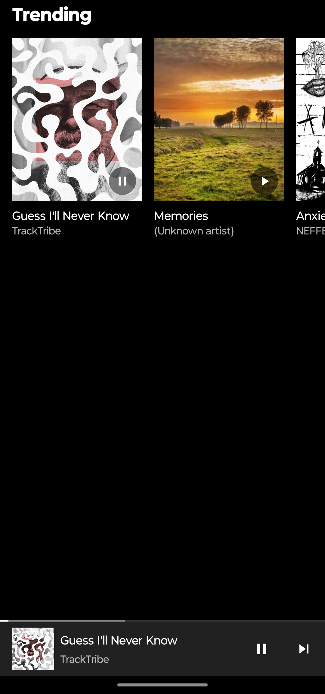
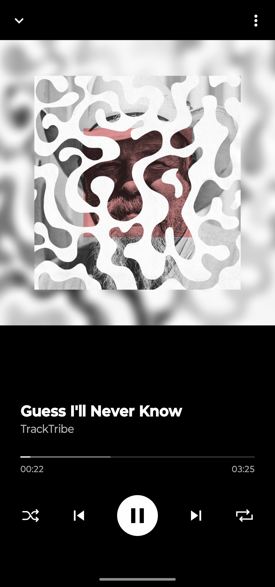

# Getting Started

## Step 1: Start the Metro Server

```bash
# using npm
npm start

# OR using Yarn
yarn start
```

## Step 2: Start your Application

### For Android

```bash
# using npm
npm run android

# OR using Yarn
yarn android
```

## Screenshots



